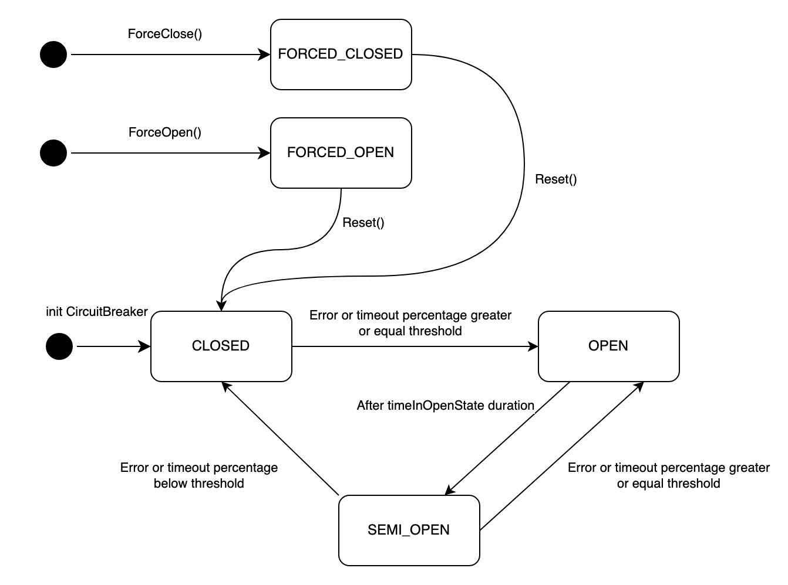

circuit breaker
====================

The Circuit Breaker library is a fault tolerance library implementing the circuit breaker design pattern.



## Quick Start
A `CircuitBreaker`  instance with a given name can be created using the `Get` function. Further calls to `Get()`  using the same provided name will return the same instance of a `CircuitBreaker`.
Define the logic which calls a dependency and pass this function to `Protect()`. If the system is healthy i.e. `CLOSED` or `SEMI_OPEN` state, the passed function will be executed.

### Initialising a CircuitBreaker instance
```go

var cb *circuitbreaker.CircuitBreaker
 
func init() {
    var err error
 
    // Initialise a Config with default values
    config := circuitbreaker.NewDefaultConfig()
 
    // Alter the values of some fields
    config.SlidingWindowSize = 20
    config.ErrorPercentThreshold = 40
 
    // Initialise a CircuitBreaker with the created Config
    cb, err = circuitbreaker.Get("rpc_cb", &config)
    if err != nil {
        panic(err)
    }
}
```

### Protecting an RPC call
```go
// case 1: for SPEX service call
func spexRPC(ctx context.Context) error {
    var code uint32
    err := cbForSpexRPC.Protect(func() error {
        code = sps.RPCRequest(ctx, "target.spex.cmd", req, resp)
        if isSpexError(code) {
            return fmt.Errorf("err_calling_target_spex_cmd, code=%d", code)
        }
        return nil
    }, yourFallBackFunc)
 
    if err != nil {
        // handle error here
    }
}
 
// case 2: for TCP service call
func tcpCall(ctx context.Context) {
    req := &beeshop_cmd.GetShop{
        Shopid: proto.Int32(123123),
    }
    res := &beeshop_cmd.ResponseShop{}
    err := cbForTCP.Protect(func() error {
        return tcpManager.RequestV2(ctx, "core_server", int32(beeshop_cmd.Command_CMD_GET_SHOP), req, res, options...)
    }, yourFallBackFunc)
 
    if err != nil {
        // handle error here
    }
}
 
 
// case 3: for HTTP service call
func httpCall(ctx context.Context) {
    err := cbForHTTP.Protect(func() error {
        client := http.GetClient()
        var err error
        result, err = client.RequestWithContext(ctx, http.GET, url, http.JSON, data, headers)
        return err
    }, yourFallBackFunc)
 
    if err != nil {
        // handle error here
    }
}
```
